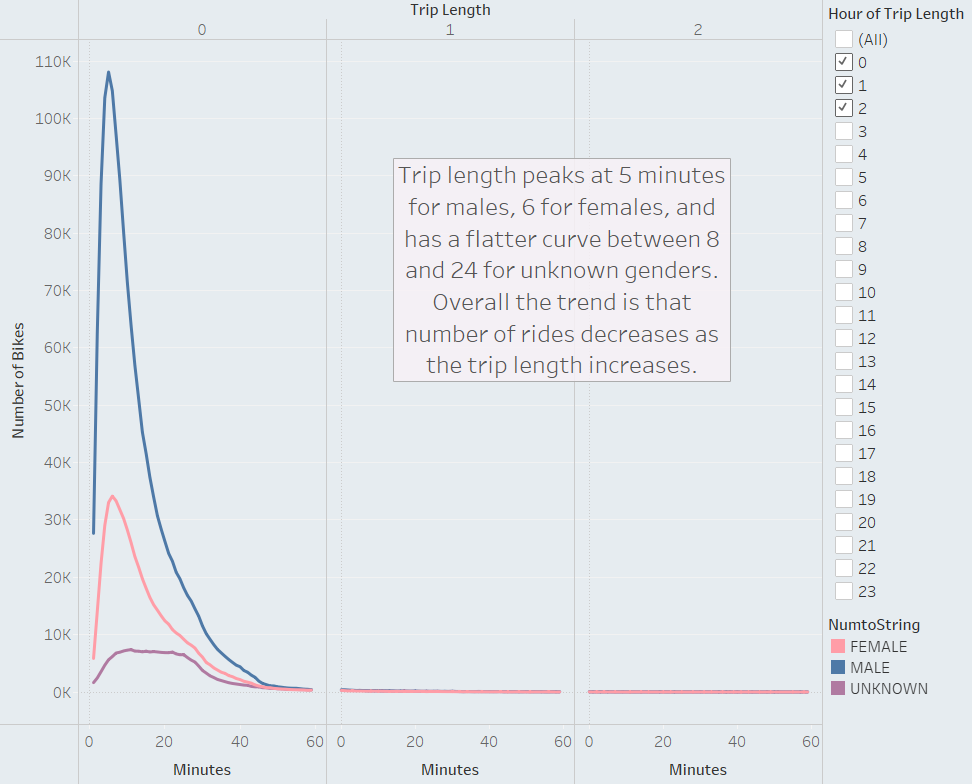

# bikesharing

## Overview
The purpose of this analysis is to look at data from the New York City bike share program Citibike. This analysis looks at data from August 2019. It can be used to help determine if a similar program would work in other cities. The data was reviewed and visualization developed in Tableau. The link to the Tableau story can be found here: [Tableau Story]("https://public.tableau.com/shared/G9C43M56Q?:display_count=n&:origin=viz_share_link")

## Results
7 visualizations 
1. 

This dashboard shows a breakdown of information related to the basic user profile. The majority (65%) of users are male. The majority of customers are regular subscribers (79%). 1990 tends to be the most common birth year. The spike at 1969 is likely to be anomoly since it does not follow the trend. It could be due to a default year set in the system. Looking at cities population breakdown related to gender and age could help determine which cities are good candidates for a similar program.

2. 

This visualization shows the breakdown of stop times. The darker purple shows higher frequency. The peak times are typical commuting times on weekdays and midday on weekends. Having bikes available at these times in locations near high occupancy apartments and business locations is ideal.

3. 

This shows the same data broken down by gender. The trends follow for male and female users with higher frequency at commuting times. Unknown gender had a higher frequency on weekends.

4. 

This shows the data broken down by gender, day and user type. Customers have a higher usage on weekends, whereas subscribers have a higher useage on weekdays, with Thursday being the highest.

5. 

This chart shows frequency of trip duration. The most common trip duration is 5 minutes, with the frequency decreasing as the trip length increases.

6. 

This chart shows similar trends to the overall trip length chart, with minor differenced by gender. The trip length peaks at 5 minutes for males, 6 for female, unknown gender has a flatter curve between 8 and 24 minutes. After the peak trip length, the frequency drops as the length increases.

7. 

This chart shows the starting and ending locations for trips. The starting and ending locations are fairly similar. Highest usage is in midtown Manhattan.

## Summary 
Based on the charts above the highest demographic is males roughly around the age of 30 using the bikes mainly during commuting times in the morning and evening of weekdays. Customers use the bikes more on weekends in the middle of the day. Low usage times in the early morning hours is a good time for servicing.

An example of an additional visualization to perform could include breaking down the starting and ending locations based on customer type or day of the week. Since we know that weekday subscribers tend to use the bikes during commuting times, but customers use the bikes more on the weekends, the weekday and weekend locations may vary from business and housing areas to tourist areas.

Another example would be a graph similar to that in number six but to filter it by user type instead of gender. This could show different usage patterns for subscribers vs customers.